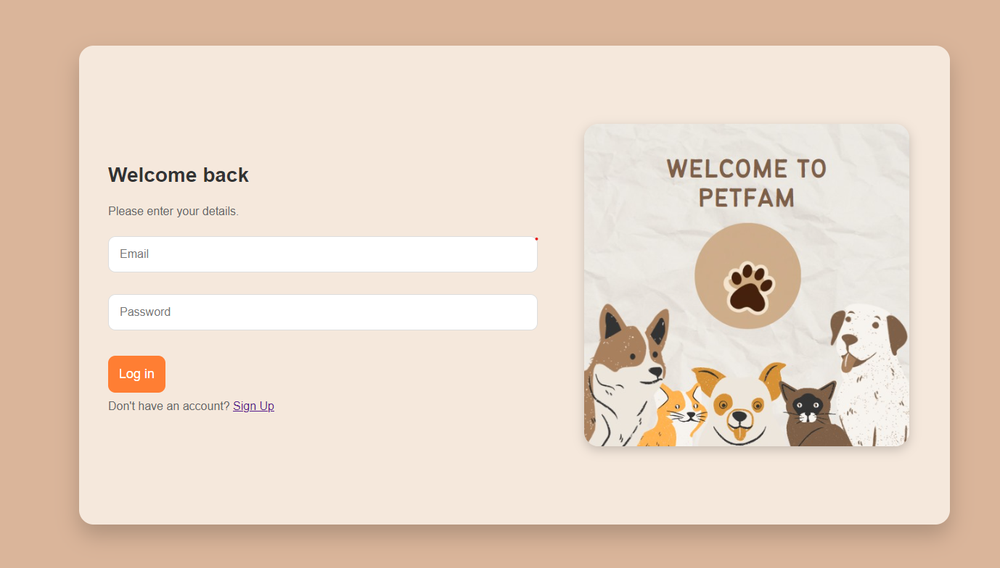
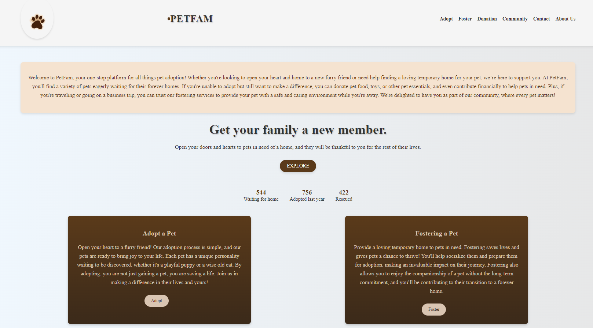
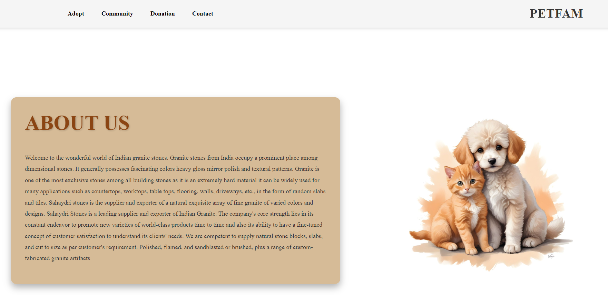
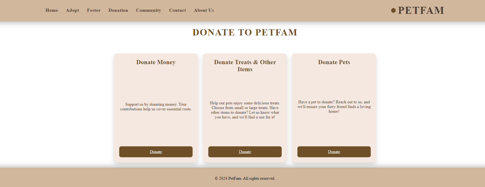
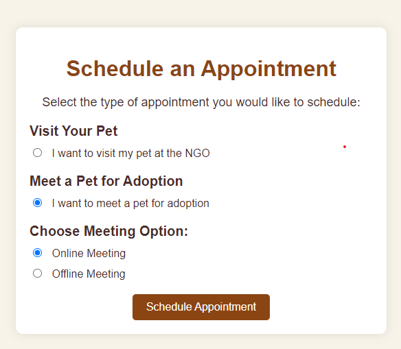

# PetFam

**PetFam** is a comprehensive platform for seamless **pet adoption, fostering, and donations**. It connects NGOs, donors, pet owners, and adopters, making the process of finding and caring for pets simple and safe. The platform allows users to adopt pets, donate to NGOs, and arrange fostering services, all while ensuring transparency and security.

## Table of Contents
- [Features](#features)
- [Installation](#installation)
- [Usage](#usage)
- [Technologies Used](#technologies-used)
- [Screenshots](#screenshots)
- [Contributing](#contributing)
- [License](#license)

---

## Features

- **Pet Adoption**: Browse available pets for adoption and schedule visits with NGOs.
- **Pet Fostering**: Register to foster pets, with detailed profiles for each pet.
- **Donations**: Securely donate to NGOs for pet care.
- **Appointment Scheduling**: Schedule online or offline meetings with pets.
- **Pet Care Inventory**: Manage pet care items like food, toys, and health supplies for NGOs.
  
---

## Installation

To run **PetFam** locally, follow these steps:

1. Clone the repository:
   ```bash
   git clone https://github.com/Sharo-11/PetFam.git
   cd petfam
   ```

2. Set up a virtual environment:
   ```bash
   python -m venv venv
   source venv/bin/activate  # On Windows, use `venv\Scripts\activate`
   ```

3. Install the required dependencies:
   ```bash
   pip install -r requirements.txt
   ```

4. Set up the database:
   ```bash
   flask db init
   flask db migrate -m "Initial migration"
   flask db upgrade
   ```

5. Run the application:
   ```bash
   flask run
   ```

---

## Usage

1. **Adoption**: Browse the available pets, select a pet profile, and schedule a visit or adoption application.
2. **Fostering**: Interested users can browse pets eligible for fostering and apply to temporarily care for a pet until a permanent home is found.
3. **Donations**: Use the donation section to contribute to the welfare of pets in need.
4. **Appointment Scheduling**: Schedule an online or offline meeting with the pet before making a final decision on adoption or fostering.
5. **Inventory Management**: NGOs can manage their inventory of pet care products, donations, and foster requests directly from the platform.

--- 

## Technologies Used

- **Flask** (Backend Framework)
- **SQLAlchemy** (Database ORM)
- **HTML/CSS/JavaScript** (Frontend)
- **SQLite** (Database)
- **WTForms** (Form Handling)

---

## Screenshots

### Login Page


### Homepage


### About Us Oage


### Donation Page


### Appointment Scheduling


---

## Contributing

Contributions are welcome! Please follow these steps:

1. Fork the repository.
2. Create your feature branch (`git checkout -b feature/AmazingFeature`).
3. Commit your changes (`git commit -m 'Add some AmazingFeature'`).
4. Push to the branch (`git push origin feature/AmazingFeature`).
5. Open a pull request.

---

## License

This project is licensed under the MIT License - see the [LICENSE](LICENSE) file for details.

---